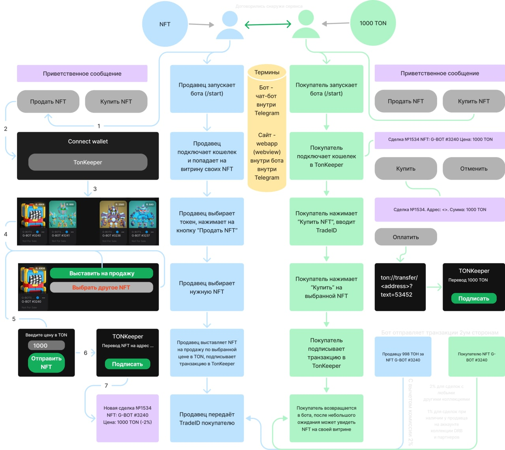

# NFT exchange

##FRONTEND

### Available Scripts

In the project directory, you can run:

#### `npm run start`

Runs the app in the development mode. 
Open [http://localhost:3000](http://localhost:3000) to view it in the browser.

The page will reload if you make edits. 
You will also see any lint errors in the console.

#### `npm run build`

Builds the app for production to the `build` folder. 
It correctly bundles React in production mode and optimizes the build for the best performance.

The build is minified and the filenames include the hashes. 
Your app is ready to be deployed!

### General diagram

## TELEGRAM BOT

### Deploy bot
Прежде чем начинать разработку, бота необходимо зарегистрировать и получить его уникальный id, являющийся одновременно и токеном. Для этого в Telegram существует специальный бот — @BotFather.

Пишем ему /start и получаем список всех его команд.
Первая и главная — /newbot — отправляем ему и бот просит придумать имя нашему новому боту. Единственное ограничение на имя — оно должно оканчиваться на «bot». В случае успеха BotFather возвращает токен бота и ссылку для быстрого добавления бота в контакты, иначе придется поломать голову над именем.

Для начала работы этого уже достаточно. Особо педантичные могут уже здесь присвоить боту аватар, описание и приветственное сообщение.

Не забудьте проверить полученный токен с помощью ссылки api.telegram.org/bot<TOKEN>/getMe, говорят, не всегда работает с первого раза.

### Set token to server

В файле .env в репозитории сервера добавить название бота и его токен.

